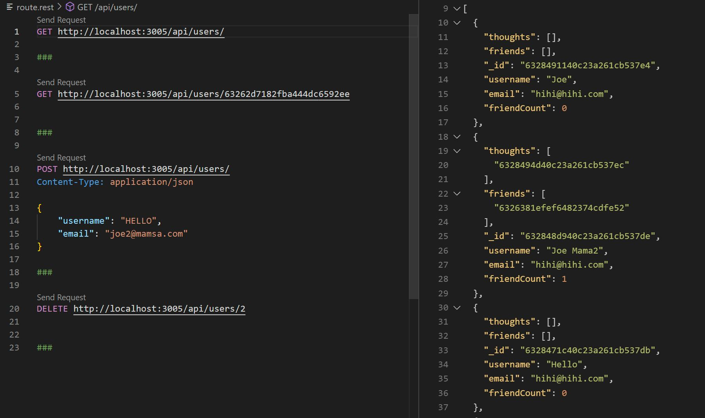

# Social Network API

## Installation

1. Download/ Clone this repository;.
2. **Node.js** and **MongoDB, MongoDBCompass** are required to test this application.
3. `npm install` in terminal to install all required dependencies.

## Usage

* `npm start` to start the server.
* `npm run watch` to test the server using nodemon.
* In Insomnia go to `http://localhost:3001`
* Users route: `http://localhost:3001/api/users`
* Thoughts route: `http://localhost:3001/api/thoughts`

* [Video Demo](https://www.youtube.com)

## Features 

* Javascript
* Insomnia
* .env
* MongoDB
* Mongoose
* npm

Copyright (c) BoiledLettuce. All rights reserved.